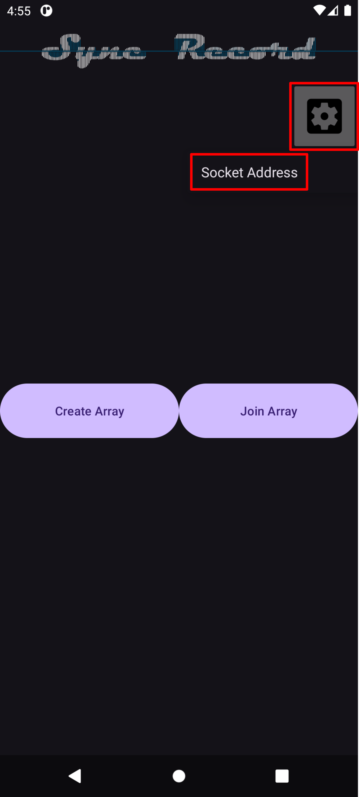
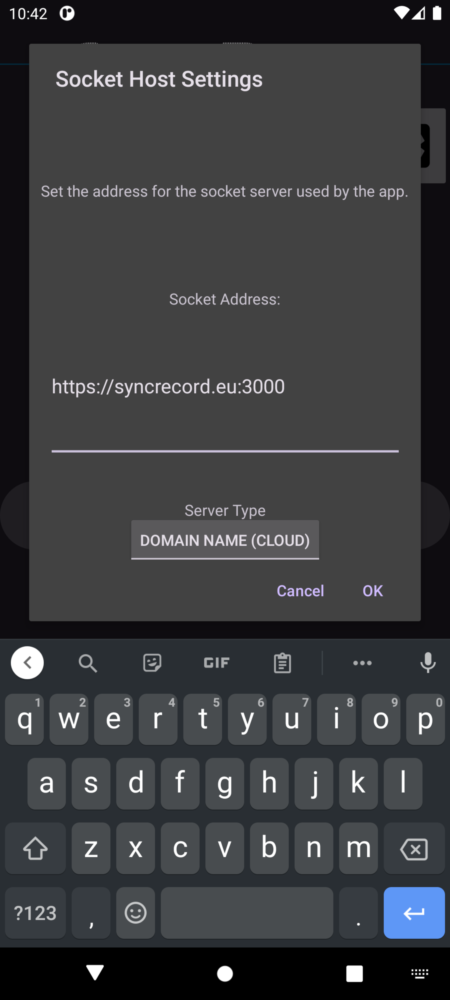
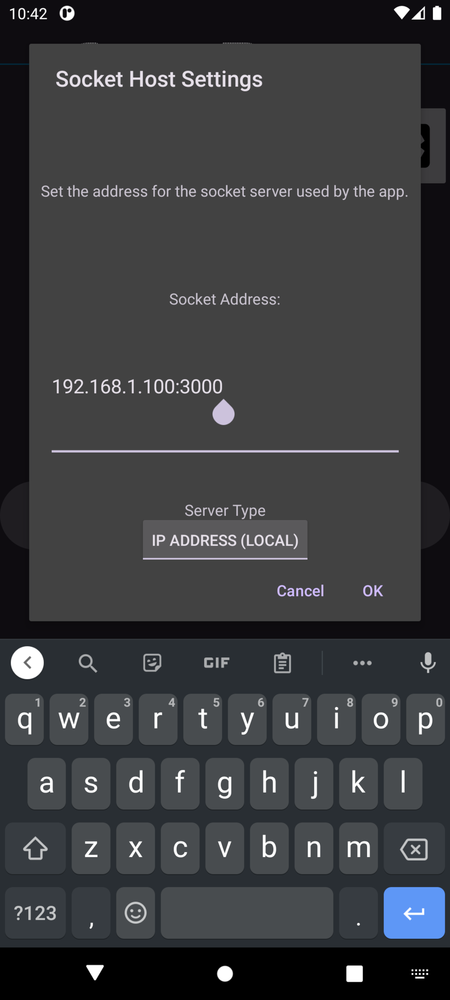
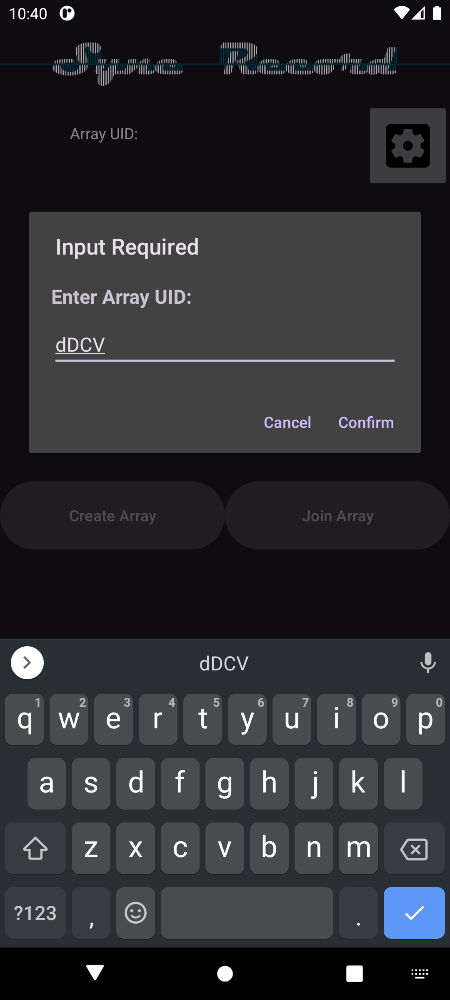
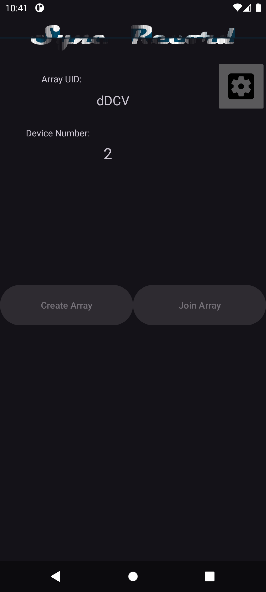
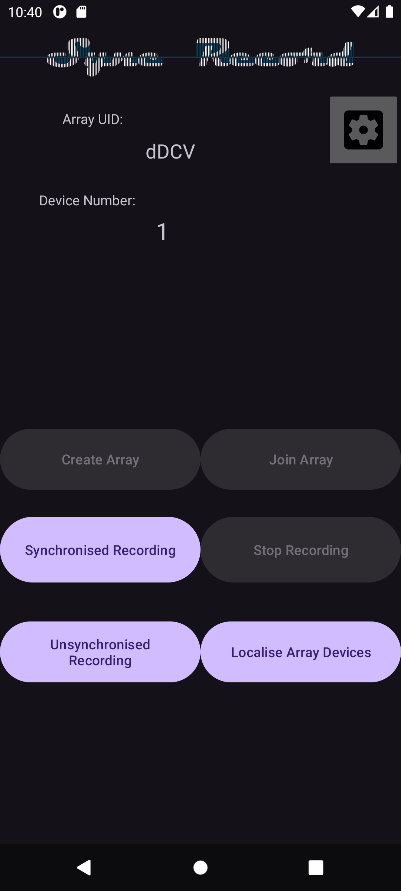

# SyncRecord
*Ad hoc synchronised microphone arrays using Android smartphones*

[](LICENSE)
[](https://doi.org/10.5281/zenodo.20383165)
[](https://f-droid.org/packages/app.mcevoy.syncrecordapp)
[](https://github.com/PadraicMCE/SyncRecord/releases)
[](https://github.com/PadraicMCE/SyncRecord/issues)
[](https://github.com/PadraicMCE/SyncRecord/stargazers)

Client app available through F-Droid:  
[](https://f-droid.org/packages/app.mcevoy.syncrecordapp)

---

# 1. Overview

**SyncRecord** is an open‑source Android application that turns a group of smartphones into a synchronised microphone array. By transforming grouped mobile devices into ad hoc microphone arrays, SyncRecord supports distributed acoustic sensing, sound source localisation, and multi‑device audio acquisition.

The system employs audible pseudo-random binary sequences (PRBS) and cross-correlation analysis to estimate inter-device propagation delays and achieve sub-millisecond synchronisation accuracy (testing shows a mean of 2 samples at 48 kHz = 42 µs). Using only the recorded audio, and inter-device distances provided by SyncRecord, you can also infer the relative positions of participating devices.

**Key results:**

- Sub‑millisecond audio stream temporal alignment (≈ 2 samples at 48 kHz)
- Estimation of the relative geometric positions of the devices (purely from audio)
- Cloud-hosted option: transient-only data handling — no audio is stored permanently on the server
- Locally-hosted option: easier customisation and data access

---

# 2. Features

- Multi‑device synchronised audio recording on Android 10+ devices (requires `MediaRecorder.AudioSource.UNPROCESSED` support)
- Three operating modes:
  1. **Synchronised Recording** — Combines localisation and continuous recording to synchronise audio streams
  2. **Localise Array Devices** — Used to only compute distances between devices
  3. **Unsynchronised Recording** — Continuous streams, no localisation
- Sub‑millisecond alignment — ≈ 2 samples at 48 kHz (≈ 42 µs)
- Server can run **locally** (LAN) or on a **cloud** instance (HTTPS + TLS)
- When cloud-hosted, all data are transient — audio is deleted after the session ends
- Open‑source, MIT‑licensed, fully extensible (Kotlin client, Node.js + Python backend)
- DOI for citation

**Useful for:**
- Distributed acoustic sensing
- Sound‑source localisation
- Multi‑device audio acquisition for research or field work

---

# 3. System Architecture

SyncRecord consists of three main components:

### 3.1 Client Application (Android)
The Android app handles audio capture, audible PRBS emission, UI, and websocket communication.

### 3.2 Server Application (Node.js)
Node.js orchestrates sessions, stores audio stream PCM data, and calls Python scripts.

### 3.3 Signal Processing Scripts (Python)
Python scripts run on the server to carry out the signal processing tasks:
- **`Detection.py`** — Extracts pairwise delays and distances via cross-correlation
- **`SyncAudio.py`** — Aligns streams and builds the final archive

---

# 4. Quick Start

## 4.1 Server (Docker)

A Dockerfile is included in the repo. This is the quickest way to get the server up and running.

If you don't have Docker installed:
[Install Docker](https://docs.docker.com/engine/install/)

From the main `SyncRecord/` directory, build and run the container:

```bash
docker compose up -d --build
```
This will run the Docker container with no console output.  
To stop the container (and server):
```bash
docker compose down
```

You only need to build the Docker container once, or after any changes made to the server files. To run the docker container again without rebuilding:
```bash
docker compose up -d
```
Check the container is running:
```bash
docker ps
```
The server runs as a local deployment by default. To change to cloud deployment, set the `local_deploy` variable to `false` in `SyncRecord/server.js` before building or rebuilding.

## 4.2 Client App

Install the SyncRecord app on the Android smartphones being used in the microphone array.

**Via F-Droid:**
[](https://f-droid.org/packages/app.mcevoy.syncrecordapp)

**Via APK:**
A build of the SyncRecord `.apk` file is located in the `SyncRecord/Android/` directory of this repo.

### First-time configuration (client side)

1. Launch the **SyncRecord** app on the device.
2. Open **Settings** (gear icon) → **Socket Address**
3. Enter the server address:

   | Deployment | Address |
   |---|---|
   | Local server | `http://<your-PC-IP>:3000` |
   | Cloud server | `https://<your-domain>:3000` |

4. Choose **Connection type** (`Local` or `Cloud`) to match the server you started.

  

The client will now be able to join sessions hosted by that server. Use the port number of your Docker container in the server address entered here.

### Running a recording session

1. On the master device, press **Create Array**. A 4-character array unique identifier (UID) appears.
2. On slave device(s), press **Join Array** and enter the UID shown on the master device, then press **Join**. Each slave device will be assigned a device number in the mic array.  
   
3. On the master device, choose one of three modes:
   - `Synchronised Recording`
   - `Unsynchronised Recording`
   - `Localise Array Devices`  
	
4. In `Synchronised Recording` and `Unsynchronised Recording` modes, the master can **Stop** the recording session when finished. In `Localise Array Devices` mode, the localisation steps complete automatically.
5. Retrieve your data:
   - **Cloud-hosted:** After recording has stopped, the master receives a zip file containing audio streams and metadata.
   - **Locally-hosted:** Files remain on the server in the `SyncRecord/public/tmp/<UID>` directory.

---

# 5. Installation from Source

### Prerequisites

| Component | Version |
|---|---|
| Android SDK | 31 (Android 10) — device must support `MediaRecorder.AudioSource.UNPROCESSED` |
| Kotlin | 1.8 |
| Gradle | 8.13 (wrapper included) |
| Node.js | v18.19.1 |
| npm | 9.2.0 (bundled with Node.js) |
| Python | 3.12.3 |

### Server directory layout
**Server:**  
SyncRecord/  
|  
|- Android/     
|&nbsp;&nbsp;&nbsp;&nbsp;|- SyncRecordApp/      
|&nbsp;&nbsp;&nbsp;&nbsp;|- SyncRecord.apk      
|- public/  
|&nbsp;&nbsp;&nbsp;&nbsp;|- tmp/  
|&nbsp;&nbsp;&nbsp;&nbsp;|&nbsp;&nbsp;&nbsp;&nbsp;| -`<UID>`  
|&nbsp;&nbsp;&nbsp;&nbsp;|&nbsp;&nbsp;&nbsp;&nbsp;| -`<UID>`  
|&nbsp;&nbsp;&nbsp;&nbsp;|&nbsp;&nbsp;&nbsp;&nbsp;| -`<UID>`  
|- ssl/  
|&nbsp;&nbsp;&nbsp;&nbsp;|- openssl/  
|&nbsp;&nbsp;&nbsp;&nbsp;|&nbsp;&nbsp;&nbsp;&nbsp;|- privkey.pem  
|&nbsp;&nbsp;&nbsp;&nbsp;|&nbsp;&nbsp;&nbsp;&nbsp;|- cert.pem  
|&nbsp;&nbsp;&nbsp;&nbsp;|- cert.pem  
|&nbsp;&nbsp;&nbsp;&nbsp;|- chain.pem  
|&nbsp;&nbsp;&nbsp;&nbsp;|- fullchain.pem  
|&nbsp;&nbsp;&nbsp;&nbsp;|- privkey.pem  
|- server.js  
|- Detection.py  
|- SyncAudio.py  
|- PackAudio.py     
|- prbs1_template_delta.csv 

### Server setup (without Docker)

The server requires Node.js and npm to install and run.

#### 1. Install Node.js

**Linux:**
```bash
sudo apt update
sudo apt upgrade
sudo apt install nodejs
sudo apt install npm
```

**Windows:**
<a href="https://nodejs.org/en/download" target="_blank">https://nodejs.org/en/download</a>

**macOS:**
Installing NodeJS on MacOS and following steps 2 -> 4 should work. But it has not been tested.

#### 2. Clone the repository
```bash
git clone https://github.com/PadraicMCE/SyncRecord.git
cd SyncRecord
```
#### 3. Install dependencies
```bash
pip install -r requirements.txt
npm init
npm ci
npm audit fix
```
#### 4. Run the server
```bash
node server.js
```
For cloud deployment, change the `local_deploy` variable to false, in the `SyncRecord/server.js` script before running.

#### SSL Certificates
The repo ships with a self-signed SSL certificate for local hosting, generated using OpenSSL and stored in `SyncRecord/ssl/openssl/`. It is the user's responsibility to ensure network security. For cloud deployment, the server administrator must provide their own SSL certificates in `SyncRecord/ssl/` (cert.pem, chain.pem, fullchain.pem, privkey.pem).

#### Building the client application
An Android Studio project source code is contained within the `SyncRecord/Android/SyncRecordApp` directory.

---

# 6. Usage instructions

## 6.1 Server Administrators

### Deploying locally (Docker)
```bash
docker compose up -d --build
```
The server runs as a local deployment by default — all audio and metadata remains stored within the server directory at `SyncRecord/public/tmp/<UID>`.

### Deploying on the cloud (Docker)
Change the value of `local_deploy` in `SyncRecord/server.js` to `false` before building and running the Docker container. Ensure your SSL certificates have been added to `SyncRecord/ssl/`.

### Deploying without Docker
```bash
node server.js
```
The server listens for connections on port 3000.

## 6.2 System Users

Install the Android app using the included .apk file or through F-Droid.

Connect through the default deployed SyncRecord server, or change the connection settings in the app options.
Create an array (generates a UID) -> slave(s) join the array using the UID -> the master chooses one of three operating modes.

### Retrieving audio recordings and/or metadata

Deployment | Data location  
Local | `SyncRecord/public/tmp/<UID>/`  
Cloud | Downloaded as a zip file after recording; no data stored post-session.

---

# 7. Testing

Recorded test data is available in `SyncRecord/public/test_data/` to exercise the signal processing scripts.

## Testing Detection.py

Runs cross-correlation on a single set of sudio recordings with ground-truth distance information:
```bash
python Detection.py ./public/test_data/ ./public/test_data/1751379318 ./public/test_data/1751379318_2.pcm ./public/test_data/1751379318_3.pcm ./public/test_data/1751379318_4.pcm
```

## Testing SyncAudio.py

Distance information is needed to run `SyncAudio.py`. This is available in `./public/test_data/` and is overwritten when `Detection.py` is run:
```bash
python SyncAudio.py ./public/test_data/ ./public/test_data/1751379318_sync ./public/test_data/1751379318_2.pcm ./public/test_data/1751379318_3.pcm ./public/test_data/1751379318_4.pcm
```

---

# 8. Data Handling and Privacy

- **No persistent cloud storage** — When cloud-hosted, after the master downloads the zip archive and the session ends, the server discards all audio and metadata. When locally-hosted, the files remain on the server.
- **Encryption** — The server uses TLS certificates, and the websocket is encrypted end-to-end.
- **No user accounts** — Arrays and recording sessions are identified only by the short UID; there is no login or personal data collected.

---

# 9. Contributing

Contributions are welcome! SyncRecord is an open-source project and we appreciate community involvement.

### How to contribute

1. **Fork** the repository
2. **Create a feature branch** from `main`:
   ```bash
   git checkout -b feature/my-new-feature
   ```
3. **Commit your changes** with clear, descriptive commit messages.
4. **Submit a pull request** describing what you changed and why.

### Guidelines
- Follow the existing code style (Kotlin for Android client, Node.js/Python for the server)
- Include comments for any new signal processing logic.
- Update the README if your changes add new features or modify existing behaviour.
- If adding a new operating mode or modifying audio capture, test with at least two physical devices.

### Reporting issues

Found a bug or have a feature request? Please [open an issue](https://github.com/PadraicMCE/SyncRecord/issues) and include:
- Device model(s) and Android version
- Server deployment type (local/cloud, Docker/manual)
- Steps to reproduce
- Expected vs. actual behaviour

---

# 10. Citation & License

## Citation

If you use SyncRecord in your research, please cite it using the citation file included in this repo, or the BibTeX entry below:
```bibtex
@software{syncrecord,
  author       = {McEvoy, Padraic},
  title        = {{SyncRecord: Ad hoc synchronised microphone arrays using Android smartphones}},
  year         = {2025},
  publisher    = {Zenodo},
  doi          = {10.5281/zenodo.20383165},
  url          = {https://doi.org/10.5281/zenodo.20383165}
}
```

A Preprint of the paper is available at: https://doi.org/10.5281/zenodo.20398119

# License
The **source code** in this repository is released under the **MIT License**.

The **paper** that describes SyncRecord is licensed under **Creative Commons Attribution 4.0 International (CC-BY 4.0)** as required by the *Journal of Open Research Software*.
