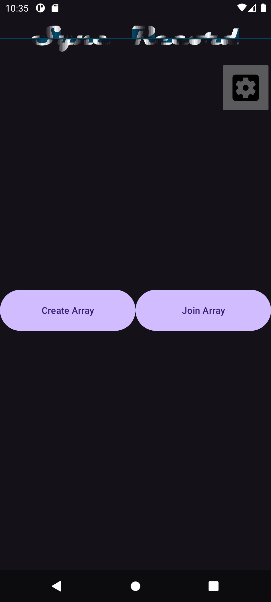

# SyncRecord
*Ad hoc synchronised microphone arrays using Android smartphones*

[](LICENSE)

[](https://doi.org/10.5281/zenodo.20383165)

[](https://f-droid.org/packages/app.mcevoy.syncrecordapp)

# 1. Overview
**SyncRecord** is an open‑source Android application that turns a group of smartphones into a synchronised microphone array. 
By transforming grouped mobile devices into ad hoc microphone arrays, SyncRecord supports distributed acoustic sensing, sound source localisation, and multi-device audio acquisition.

The system employs audible pseudo-random binary sequences (PRBS) and cross-correlation analysis to estimate inter-device propagation delays and achieve sub-millisecond synchronisation accuracy (Testing shows a mean of 2 samples at 48 kHz = 42 µs).  
Using only the recorded audio, and inter-device distances provided by SyncRecord you can also infer the relative positions of participating devices.

Result:

- Sub‑millisecond audio stream temporal alignment (≈ 2 samples at 48 kHz)
- Estimation of the relative geometric positions of the devices. (purely from audio)
- Cloud-hosted option: Transient‑only data handling – no audio is stored permanently on the server.
- Locally-hosted option: Easier customisation and data access.

---

# 2. Features
- Multi‑device synchronised audio recording on Android 10+ devices (requires `MediaRecorder.AudioSource.UNPROCESSED` support)
- Three operating modes
1. **Synchronised Recording** - Combines localisation and continuous recording to synchronise auto streams.
2. **Localise Array Devices** - Used to only compute distances between devices.
3. **Unsynchronised Recording** - Continuous streams, no localisation.

- Sub‑millisecond alignment – ≈ 2 samples at 48 kHz (≈ 42 µs).
- Server can run **locally** (LAN) or on a **cloud** instance (HTTPS + TLS).
- When cloud-hosted all data are transient – audio is deleted after the session ends.
- Open‑source, MIT‑licensed, fully extensible (Kotlin client, Node.js + Python backend).
- MIT Licence - free for academic and commercial reuse.
- DOI for citation.

Useful for:
- Distributed acoustic sensing. 
- Sound‑source localisation.  
- Multi‑device audio acquisition for research or field work.

---

# 3. System Architecture
SyncRecord consists of two main components:
### 1. Client Application (Android)
Android app handles audio capture, audible PRBS emission, UI, and websocket communication.

### 2. Server application (NodeJS / Python)
Node.js orchestrates sessions, stores audio stream PCM data, and calls Python scripts.

### 3. Python scripts
Python scripts run on the server to carry out the signal processing tasks. Detection.py extracts pair-wise delays and distances via cross-correlation.
SyncAudio.py aligns streams and builds the final archive.

---

# 4. Quick Start
## Using a Docker container
A Docker file is included in the repo. This is the quickest way to get the server up and running.
Use the `docker-compose.yml` file included in the repo to build and run the docker container.

If you don't have docker installed:
[Install Docker](https://docs.docker.com/engine/install/)

From the main `SyncRecord/` directory, build and run the container:
```bash
docker compose up -d --build
```
This will run the docker container with no console output.

To stop the container (and server):
```bash
docker compose down
```

You only need to build the docker container once, or after any changes made to the server files. To run the docker container again without rebuilding:
```bash
docker compose up -d
```

You can check the container is running:
```bash
docker ps
```

The server is run as local deployment by default. To change to cloud deployment, change the `local_deploy` variable to `false` in the `SyncRecord/server.js` script before running.

You can also setup and run the server without using a Docker container. See further instructions in section `5. Installation and Building`

## Client
#### Install the SyncRecord Android App
Install the SyncRecord App .apk on the Android smartphones being used in the microphone array.
The SyncRecord .apk file is located in the `SyncRecord/Android/` directory.

#### First-time configuration (client side)
1. Launch the **SyncRecord** app on the device.
2. Open the **Settings** (gear icon) -> **Socket Address**
3. Enter the server address:

    *For a local server:* 
    `http://<your-PC-IP>:3000`

	*For a cloud server:* 
    `https://<your-domain>:3000`
4. Choose **Connection type** (`Local` or `Cloud`) to match the server you started.
The client will now be able to join sessions hosted by that server.


Use the port number of your docker container in the server address entered here.

#### Running a recording session
Steps:
1. On master device press `Create Array`. A 4-character array unique identifier (UID) appears.
2. On slave device(s) press `Join Array` and enter the UID shown on the master device, then press `Join`. Each slave device will be assigned a device number in the mic array.


3. On the master device, choose one of three modes: `Synchronised Recording`,`Unsynchronised Recording` or `Localise Array Devices`.


4. In `Syncronised Recording` and `Unsynchronised Recording`modes, the master can `Stop` the recording session when finished. In `Localise Array Devices` mode, the the localisation steps complete automatically.
5. If cloud-hosted, after recording has stopped, the master receives a zip file containing audio streams and metadata.
If locally-hosted, the files remain on the server in the `SyncRecord/public/tmp/<UID>` directory.

---
# 5. Installation and Building

To build from source:
#### *Prerequisites*
- *Android SDK 31 (Android 10) - Device must support* `MediaRecorder.AudioSource.UNPROCESSED` *audio source*.
- *Kotlin 1.8, Gradle 8.13 (wrapper included)*.
- *Node.js (v18.19.1 used during development), npm - bundled with Node (9.2.0 used during development)*
- *Python 3.12.3* used during development

#### Server Directory Layout:

**Server:**  
SyncRecord/  
|  
|- Android/     
|&nbsp;&nbsp;&nbsp;&nbsp;|- SyncRecordApp/      
|&nbsp;&nbsp;&nbsp;&nbsp;|- SyncRecord.apk      
|- public/  
|&nbsp;&nbsp;&nbsp;&nbsp;|- tmp/  
|&nbsp;&nbsp;&nbsp;&nbsp;|&nbsp;&nbsp;&nbsp;&nbsp;| -`<UID>`  
|&nbsp;&nbsp;&nbsp;&nbsp;|&nbsp;&nbsp;&nbsp;&nbsp;| -`<UID>`  
|&nbsp;&nbsp;&nbsp;&nbsp;|&nbsp;&nbsp;&nbsp;&nbsp;| -`<UID>`  
|- ssl/  
|&nbsp;&nbsp;&nbsp;&nbsp;|- openssl/  
|&nbsp;&nbsp;&nbsp;&nbsp;|&nbsp;&nbsp;&nbsp;&nbsp;|- privkey.pem  
|&nbsp;&nbsp;&nbsp;&nbsp;|&nbsp;&nbsp;&nbsp;&nbsp;|- cert.pem  
|&nbsp;&nbsp;&nbsp;&nbsp;|- cert.pem  
|&nbsp;&nbsp;&nbsp;&nbsp;|- chain.pem  
|&nbsp;&nbsp;&nbsp;&nbsp;|- fullchain.pem  
|&nbsp;&nbsp;&nbsp;&nbsp;|- privkey.pem  
|- server.js  
|- Detection.py  
|- SyncAudio.py  
|- PackAudio.py     
|- prbs1_template_delta.csv  

The repo comes with a self-signed ssl certificate for locally-hosting the server. This certificate was generated using OpenSSL and is stored in the `SyncRecord/ssl/openssl/` subdirectory.  It is the users responsibility to ensure network security. For cloud deployment, the server administrator needs to provide their own ssl certificate, stored in `SyncRecord/ssl/` (cert.pem, chain.pem, fullchain.pem, privkey.pem).

## Server setup without the Docker container
### Server
You can run the server without using the Docker container. The server requires NodeJS and npm to install and run.

#### 1. Download and install NodeJS
#### Running on Linux
```bash
sudo apt update
sudo apt upgrade
sudo apt install nodejs
sudo apt install npm
```

#### Running on Windows

<a href="https://nodejs.org/en/download" target="_blank">https://nodejs.org/en/download</a>

#### Running on MacOS

Installing NodeJS on MacOS and following steps 2 -> 4 should work. But it has not been tested.

---
#### Linux / Windows / MacOS

While in the SyncRecord directory:

#### 2. Clone the SyncRecord repository
```bash
git clone https://github.com/PadraicMCE/SyncRecord.git
cd SyncRecord
```

#### 3. Install dependencies
```bash
pip install -r requirements.txt
npm init
npm ci
npm audit fix
```
#### 4. Run the server
```bash
node server.js
```
For cloud deployment, change the `local_deploy` variable to false, in the `SyncRecord/server.js` script before running.

## Building the client application
An Android Studio project source code is contained within the `SyncRecord/Android/SyncRecordApp` directory.

# 6. Data Handling and Privacy
- **No persistent cloud storage** - When cloud-hosted, after the master downloads the zip archive and the session ends, the server discards all audio and metadata.  
When locally-hosted, the files remain on the server.
- **Encryption** - The uses TLS certificates, and the websocket is encrypted end-to-end.
- **No user accounts** - Arrays and recording sessions are identified only by the short UID; there is no login or personal data collected.

---
## Test Data
Recorded data is available in `SyncRecord/public/test_data` to test the signal processing scripts `Detection.py` and `SyncAudio.py`.
To test `Detection.py` on a single set of audio recordings with ground truth distance information, run the following script within the root `SyncRecord` directory.

```Bash
python Detection.py ./public/test_data/ ./public/test_data/1751379318 ./public/test_data/1751379318_2.pcm ./public/test_data/1751379318_3.pcm ./public/test_data/1751379318_4.pcm
```

Distance information is needed to run the `SyncAudio.py` script. This data is available in the `./public/test_data` directory, and is over written when `Detection.py` is run. To test the `SyncAudio.py` script run the following script within the root `SyncRecord` directory.

```Bash
python SyncAudio.py ./public/test_data/ ./public/test_data/1751379318_sync ./public/test_data/1751379318_2.pcm ./public/test_data/1751379318_3.pcm ./public/test_data/1751379318_4.pcm
```

---
---
# 5. Instructions
## Server Administrators
### Deploying the server locally

#### Within a Docker container
---
Use the `docker-compose.yml` file included in the repo to build and run the docker container.

Build the container:
```bash
docker compose up -d --build
```
This will build and run the docker container with no console output. The server will run as a local deployment by default, meaning all audio and metadata remains stored within the server directory.

Data is stored in `SyncRecord/public/tmp/<UID>`, with `<UID>` being the mic array UID.

### Deploying the server on the cloud
To run the Docker container server as a cloud deployment change the value of `local_deploy` in the `SyncRecord/server.js` script to false before building and running the Docker container. Make sure your ssl certificates have also been added to the `SyncRecord/ssl/` directory.

---
#### Without a Docker container
Run the server script. This will run the server and listen for connections on port 3000.
```bash
node server.js
```

## System Users
Android app. Install using the included .apk file or through F-Droid/Google Play.



Connect through the default deployed SyncRecord server, or change the connection settings in the app options.


Create an array (generates a UID) -> Slave(s) join the array using the UID. The mastet chooses one of three operating options (synchronised audio recording, unsynchronised audio recording, localise array devices).


### Retriving audio recordings and/or metadata
#### Locally deployed
If the server is locally deployed, the audio recordings are located at:
```bash
SyncRecord/public/tmp/UID/.
```

#### Cloud deployed
If the server is cloud deployed, the audio recordings and metadata are not stored post recording. The audio recordings and meta data are sent for download after each recording is capured, or the array is localised.

---
---
# Citation
If you use SyncRecord in your research, please use the citation file included in this repo:

# License
The **source code** in this repository is released under the **MIT License**.

The **paper** that describes SyncRecord is licensed under **Creative Commons Attribution 4.0 International (CC-BY 4.0)** as required by the *Journal of Open Research Software*.

A Preprint of the paper is available at: https://doi.org/10.5281/zenodo.20398119

